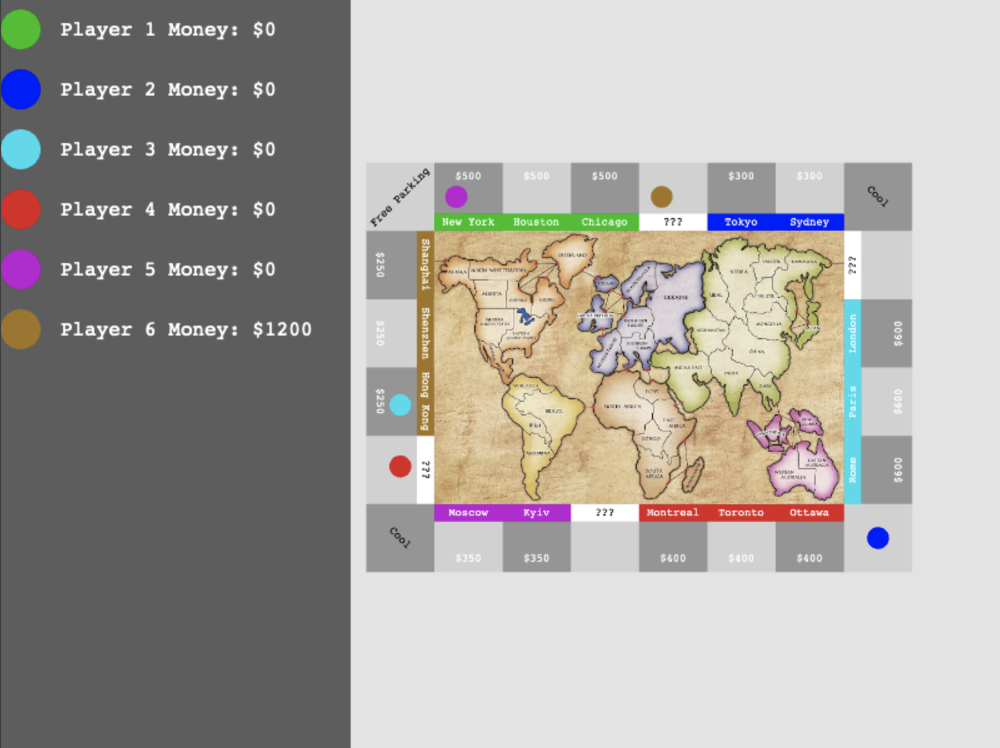

# Hegemony: Rise of Empires
A Risk x Monopoly like game

## Overview

This game combines elements of both Risk and Monopoly into a NEW game

## Game Design

### Board Layout

Monopoly game board as an outer ring, with a Risk world map in the centre.

### Resources

Money is the main resource, and can be used to buy Risk units or Monopoly property.

### Turn Structure

Same turn structure as Risk and Monopoly, with Monopoly being first.

### Win Condition

Control 51% of the Risk game board AND 51% of the Monopoly game board to win the game.

### Player Count

3 to 6 is ideal, but 2 is also acceptable.
